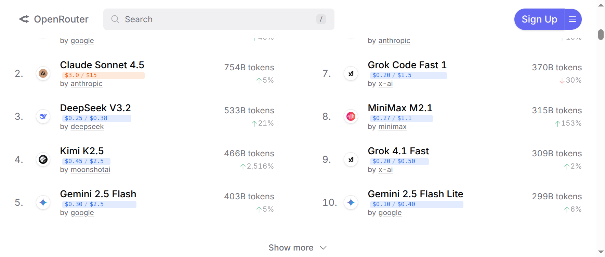

# OpenRouter Pricing Overlay

A browser extension that displays token pricing directly on [OpenRouter](https://openrouter.ai) pages, with color-coded tiers for quick cost comparison.

## Features

- **Inline pricing badges** showing input/output cost per million tokens
- **Color-coded price tiers** for instant visual comparison:
  - 🟢 Free ($0)
  - 🔵 Cheap (<$0.50/M)
  - 🟡 Mid ($0.50-2/M)
  - 🟠 Premium ($2-5/M)
  - 🔴 Frontier ($5+/M)
- **Smart caching** (1 hour) to minimize API calls
- **SPA-aware** updates when navigating without page reload
- **Minimal permissions** (only accesses openrouter.ai)

## Installation

### Chrome / Brave / Edge (Developer Mode)

1. Download or clone this repository
2. Open your browser's extension page:
   - Chrome: `chrome://extensions`
   - Brave: `brave://extensions`
   - Edge: `edge://extensions`
3. Enable **Developer mode**
4. Click **Load unpacked**
5. Select the `src/` folder

### Chrome Web Store

*Coming soon*

## Screenshots



*Pricing badges on the LLM Leaderboard showing color-coded tiers*

## How It Works

The extension fetches model data from OpenRouter's public API (`/api/v1/models`) and injects pricing badges next to model names on the page. Data is cached locally for 1 hour to minimize requests.

## Privacy

- **No data collection**: The extension does not collect, store, or transmit any user data
- **No external requests**: Only fetches from `openrouter.ai` (the site you're already on)
- **Local caching only**: Pricing data is cached in your browser's localStorage
- **Open source**: Full source code available for inspection

## Development

```bash
# Clone the repo
git clone https://github.com/broooms/openrouter-pricing-ext.git

# Load src/ folder as unpacked extension
# Make changes, then reload extension in browser
```

No build step required; the extension is vanilla JavaScript.

## Project Structure

```
openrouter-pricing-ext/
├── src/                    # Extension source (load this folder)
│   ├── manifest.json       # Extension manifest (MV3)
│   ├── content.js          # Main content script
│   ├── styles.css          # Badge styling
│   ├── icon48.png          # Toolbar icon
│   └── icon128.png         # Store icon
├── docs/                   # Documentation
│   ├── ARCHITECTURE.md     # Technical design
│   ├── CHANGELOG.md        # Version history
│   └── ROADMAP.md          # Planned features
├── README.md
└── LICENSE                 # MIT
```

## Contributing

Contributions welcome! Please:

1. Fork the repository
2. Create a feature branch
3. Make your changes
4. Test on Chrome and at least one other Chromium browser
5. Submit a pull request

## License

MIT License. See [LICENSE](LICENSE) for details.

## Disclaimer

This is an unofficial community project. It is not affiliated with or endorsed by OpenRouter.
